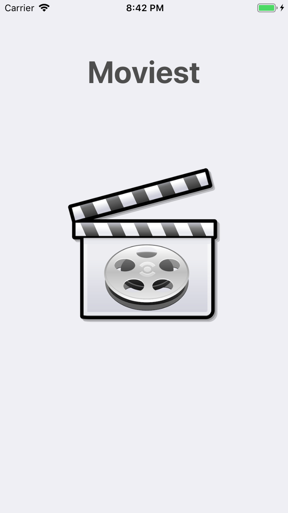
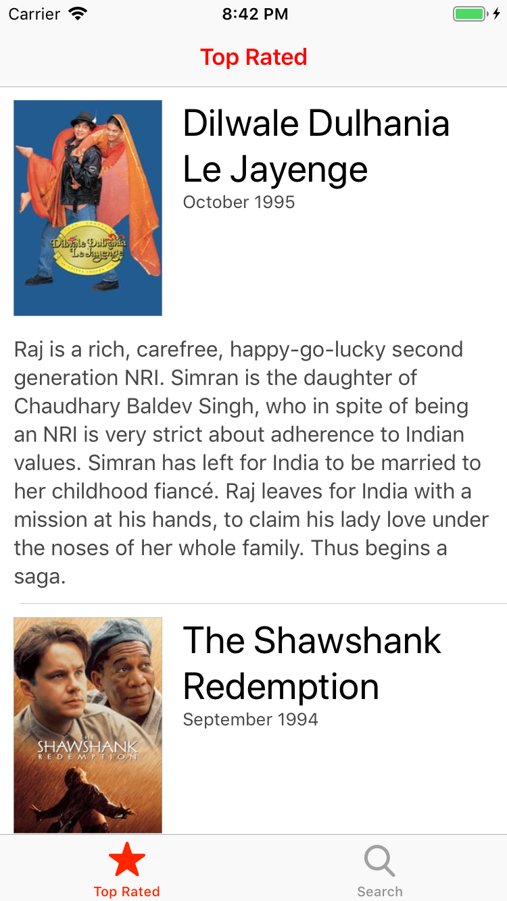
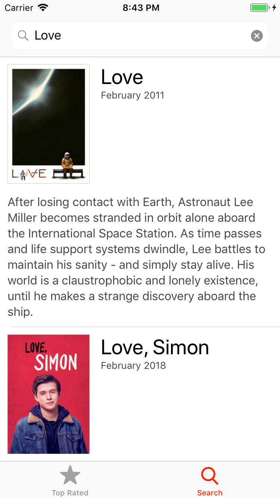
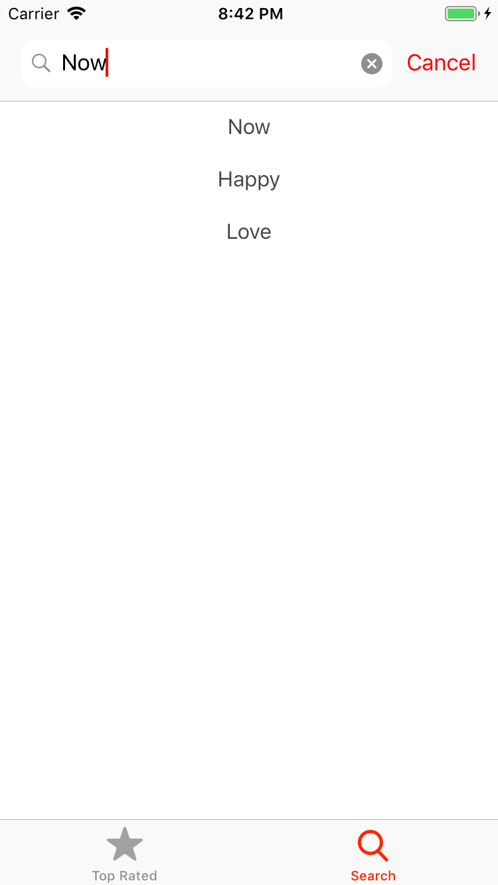
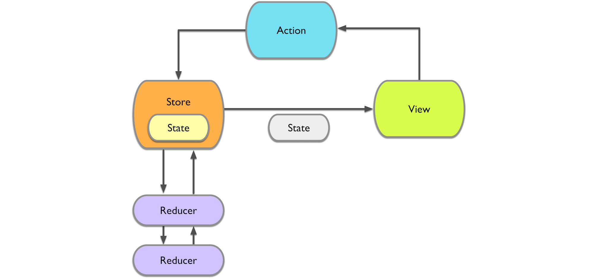

# Moviest

 
Moviest is a simple movie list application that harnesses the power of [The Movie DB API](https://developers.themoviedb.org/3/getting-started/introduction) to display top rated movies and search results from over 28,000 entries.

### Screenshots:
&nbsp;
&nbsp;
&nbsp;
 

### Features:
- See Top Rated Films
- Search for a movie
- List the last successful searches

### Requirements:
- Xcode 13+
- Swift 5+
- iOS 12+

### Installation:
1. Download the zip file.
2. Navigate to the folder
4. Open `Moviest.xcworkspace` and run the app

### Third-party Libs:
- `Alamofire` for networking
- `Kingfisher` for image caching

### Project Structure (MVVM+Redux)
From [redux.js.org](http://www.redux.js.org): `Redux is a predictable state container for JavaScript apps.`

The application use store. In this store, you have your application state. From your views, you send actions to the store and reducers execute these actions. As state is changed by reducers, store notifies the view so that it can reflect changes on UI.

##### Core benefits:
- It encourages you to find the real state of your app and model every change and action. This makes everything easy to understand.
- Maximises separation of concerns. Every component does only one job.
- Improves testability. Reducers has pure functions that are really easy to test.
- Store propagates state automatically. (So you don’t have to choose between delegation, blocks, notifications or KVO.)

For further information please check [this blog post](https://medium.com/commencis/using-redux-with-mvvm-on-ios-18212454d676). 

#### MVVM

#### Redux

